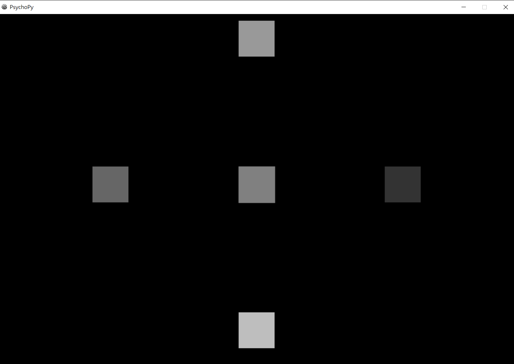

   
# CECNL_RealTimeBCI_car
### Leverage SSVEP to control car in real time

# workflow

# File description

## glitch4_gaming.py and glitch4_gaming_D.py

- code detail:
    - **blinking indicators** : there are four blinking indicators
        - *upper blinking indicators* : 11hz
        - *left blinking indicators* :  12hz
        - *right blinking indicators* : 13hz
        - *lower blinking indicators* : 14hz
    - **FrameRate** :  only for 60hz minitor
    - **execute the code** : use python enviroment to execute the code,and you can see the window like this one

    - **frame rate accuracy** : frame rate accuracy can calculate by the code, make sure the frame rate accuracy is in the interval of 1.01 and 0.99(0.99 < frame rate accuracy < 1.01), or you can't proceed the SSVEP BCI. If your frame rate accuracy is not correct, please reduce the workload of your computer(like close the other software)

## main_FBCCA.py
- Conduct Filter Bank CCA
- Main function : 
    - **fbcca_realtime**: slightly different version since we don't conduct the fbcca in real-time. 
- Core parameters: 
    - **THRESHOLD** : Define different thresholds of different subjects, since different people might have a different responses to the stimulus 
- Reference Github: https://github.com/mnakanishi/TRCA-SSVEP

# Prerequisites
1. Install anaconda
2. Open the anaconda prompt
3. Create conda env: conda create --name myenv
4. Activate your environment: conda activate myenv
5. Run conda install pip
6. Run conda install -c conda-forge pywinhook
7. Download dukpy wheel from this page https://www.lfd.uci.edu/~gohlke/pythonlibs/#dukpy

8. Run pip install \<the absolute path of dukpy.whl\>
9. Download requirements.txt
10. Run pip install -r requirements.txt

# Instruction for running the system

1. Install
    1. Install python environment
2. Connect to the car
    1. Activate  the car
    2. Activate the blue tooth and connect to the car, you can control the car via keyboard using test_car.py(this code is for testing connect between car and computer, if it is successful, you can press key (w, a,s,d) to control the car )

3. Open LSL data stream
    1. Open Cygnus
    2. Connect the device then data stream will be available

4. Open Blinking Window in one command window
 and type "python glitch4_gaming.py"
5. Open another CMD window and start the main program
    1. Type python main_FBCCA.py
    2. If the program is working, you can see the CMD window print the correlations 
between SSVEP data and different frequency stimuli every 0.5 seconds, the program also prints the direction of the command if the program sends it.
6. CHECK!!!
    - Make sure to connect the car using test_car.py
    - Ctrl+C to end the program

# Reference
- *Chen, Xiaogang, et al. "A high-itr ssvep-based bci speller." Brain-Computer Interfaces 1.3-4 (2014): 181-191.*
- *Chen, Xiaogang, et al. "High-speed spelling with a noninvasive brain–computer interface." Proceedings of the national academy of sciences 112.44 (2015): E6058-E6067.*
- *Nakanishi, Masaki, et al. "An approximation approach for rendering visual flickers in SSVEP-based BCI using monitor refresh rate." 2013 35th Annual International Conference of the IEEE Engineering in Medicine and Biology Society (EMBC). IEEE, 2013.* 
